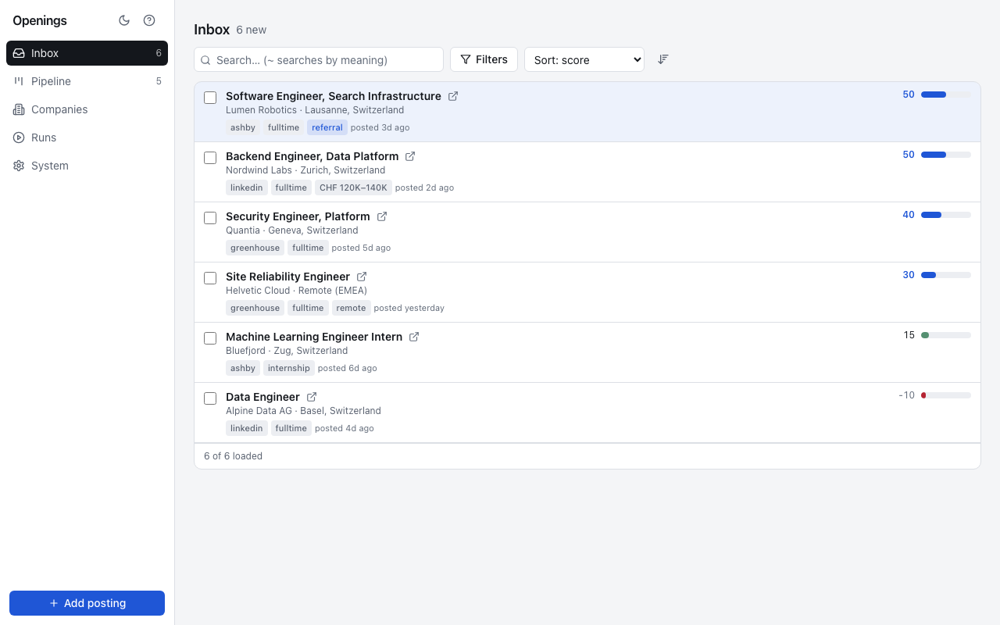
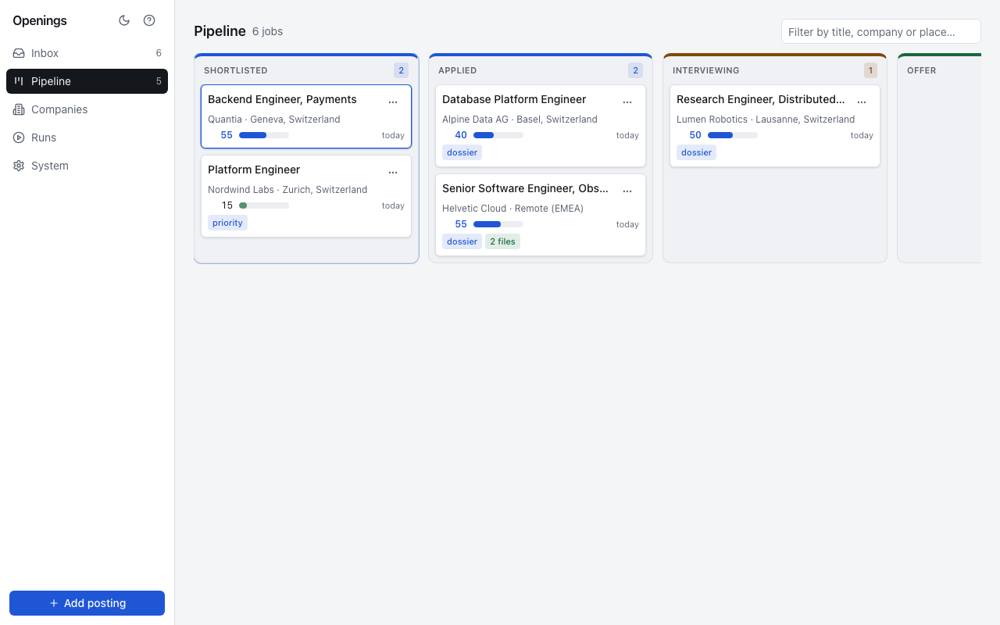
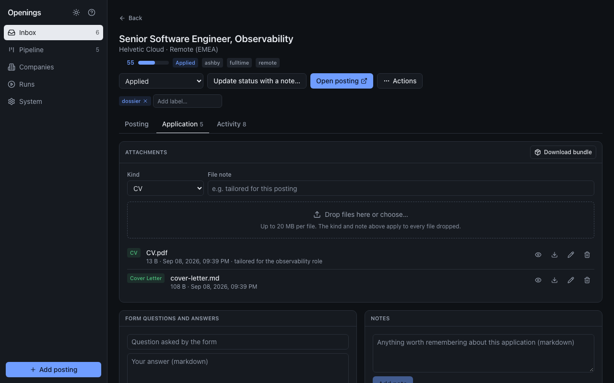

# Openings

[](https://github.com/VincenzoImp/openings/actions/workflows/ci.yml)
[](https://www.python.org/downloads/)
[](https://opensource.org/licenses/MIT)
[](https://hub.docker.com/r/vincenzoimp/openings)

A job crawler, archive and application tracker you run yourself, operable by
you and by your AI agents through the same API.



## Why

Job boards forget what you saw, spreadsheets forget what you sent, and the
CV you tailored for a role ends up in a folder nobody opens again. Openings
keeps all of it in one local database: every posting it collected, every
status change with its date, every note, form answer, CV and cover letter
attached to the job it belongs to. It is built for one person, runs in two
containers on your own machine, and never sends your data anywhere.

- **Collect** from job boards (through [JobSpy](https://github.com/speedyapply/JobSpy)),
  company career pages on Greenhouse, Lever, Ashby and SmartRecruiters, RSS
  feeds and the Adzuna API. Anything the crawler cannot see, you or an agent
  add by hand.
- **Rank** with keyword categories and signed weights you write yourself;
  every job shows which categories matched and why it scored what it did.
- **Track** one status per job from `new` to `offer`, with a timeline. A job
  is the opening, not the advert: the same role seen on two boards is one job
  with two postings. Blacklisting hides, never deletes, and can be undone.
- **Archive** the application itself next to the posting, and take it out
  again as one zip.
- **Search by meaning** with a small sentence model that runs locally.
- **Automate** through a REST API and an MCP server with the same tools the
  dashboard uses, so an agent can triage the inbox, attach a tailored CV and
  record an application while you watch the pipeline.

**The YAML owns intake and scoring; the database owns state.** A job's status
is never derived from configuration.

## Quick start

```bash
cp config/settings.example.yaml settings.yaml   # edit locations, queries, scoring
docker compose up -d
open http://127.0.0.1:8501
```

One process serves the dashboard at `/`, the REST API at `/api` and the MCP
endpoint at `/mcp`. Ports bind to `127.0.0.1` by default.

## A look around

| | |
|---|---|
|  |  |
| The Pipeline: one column per status, cards move with the keyboard, by dragging or from a menu. | The application: files with inline previews, form answers, notes, one zip for everything. |

The dashboard works on a phone as well as a desk, in light and dark. More
in [Dashboard](docs/user/dashboard.md).

## Agents

Point an MCP client at `http://127.0.0.1:8501/mcp` (streamable HTTP):

```json
{ "mcpServers": { "openings": { "type": "http", "url": "http://127.0.0.1:8501/mcp" } } }
```

A typical session: `list_jobs(statuses=["new"], min_score=40)` to triage,
`blacklist_jobs` for the noise, `get_job` for the posting and its score
breakdown, `add_attachment` with the tailored CV, `add_note` with the form
answers, `set_status(..., "applied", note="sent through the careers page")`.
For a posting the crawler never saw, `add_job` with the digested fields. The
full tool list is in [MCP server](docs/user/mcp.md).

## Configuration

Everything about *what* to collect and *how* to rank it lives in
`settings.yaml`. The [annotated example](config/settings.example.yaml) is the
reference; unknown keys fail at boot and secrets can be written as
`$ENV_VAR`.

```yaml
sources:
  jobspy:
    sites: [linkedin]
    locations: ["Berlin, Germany", "Remote"]
    queries:
      core: ["backend engineer", "platform engineer"]
  companies:
    - { name: Example, ats: greenhouse, slug: example, titles: [engineer] }
scoring:
  save_threshold: 20
  notify_threshold: 60
  weights: { role: 25, stack: 15, language_required: -60 }
  keywords:
    role: ["backend engineer", "platform engineer"]
    stack: ["python", "go", "postgresql"]
    language_required: ["fluent german", "deutsch erforderlich"]
```

See [Configuration](docs/user/configuration.md) and
[Sources](docs/user/sources.md).

## Commands

| Command | Role |
|---------|------|
| `openings scheduler` | collect on the configured interval (container default) |
| `openings run` | collect once and exit |
| `openings web` | dashboard, REST API and MCP endpoint on port 8501 |
| `openings healthcheck` | verify config, database and directories |

## Documentation

- [Docker deployment](docs/user/docker.md)
- [Configuration](docs/user/configuration.md)
- [Sources](docs/user/sources.md)
- [Dashboard](docs/user/dashboard.md)
- [REST API](docs/user/api.md)
- [MCP server](docs/user/mcp.md)
- [Operations](docs/user/operations.md)
- [Architecture](docs/developer/architecture.md)
- [Testing](docs/developer/testing.md)
- [Release process](docs/developer/release.md)

## Development

```bash
uv sync
npm --prefix frontend install
cp config/settings.example.yaml settings.yaml
OPENINGS_DATA_DIR=./data OPENINGS_CONFIG=./settings.yaml uv run openings web
uv run pytest
npm --prefix frontend run quality
npm --prefix frontend run test:e2e
```

See [CONTRIBUTING](CONTRIBUTING.md). Openings is a personal tool that grew
into a small product; issues and pull requests are welcome.

## License

MIT.
