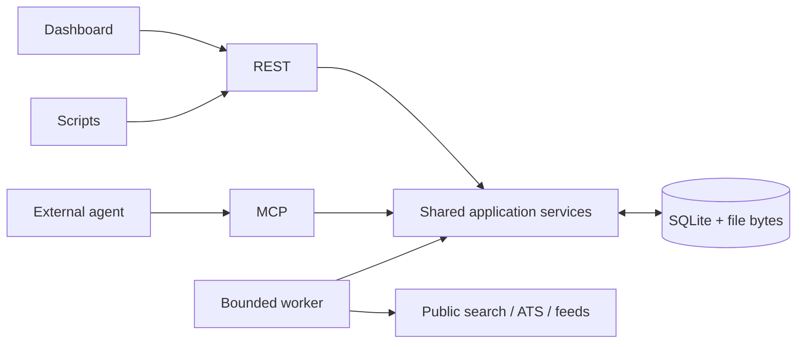

# Architecture

Openings is a FastAPI application, React dashboard and SQLite workspace. Agents, browser automation and
TeX compilation run externally; the core uses no model runtime.


```mermaid
flowchart LR
  Human[Dashboard] --> REST
  Scripts --> REST
  Agent[External agent] --> MCP
  REST --> Services[Shared application services]
  MCP --> Services
  Services <--> DB[(SQLite + file bytes)]
  Worker[Bounded worker] --> Services
  Worker --> Sources[Public search / ATS / feeds]
```

## Code map

| Location | Responsibility |
|---|---|
| `backend/openings/workspace/` | Job identities, triage, notes, application attempts and reporting |
| `backend/openings/duplicates.py`, `duplicate_signals.py` | Read-only duplicate candidates: per-job signals, pair confidence and groups |
| `backend/openings/language_signals.py` | Deterministic text signals: the posting's language and the languages it requires |
| `backend/openings/job_signals.py` | Ingest signals of each job (stored, backfilled), listing observations and the dismissal record; labels and filters, never a dismissal |
| `backend/openings/stats.py` | Stats of sent applications in a period: replies, interviews, the median days to a reply, the funnel and replies by source |
| `backend/openings/career/` | Profile, detailed evidence, claims and templates |
| `backend/openings/preferences.py` | The owner's Preferences: five free-text sections with their versions, and the settings `no_reply_days` and `spoken_languages` |
| `backend/openings/documents/` | Document revisions and scoped file transfers |
| `backend/openings/compaction.py` | Giving freed pages back to the data volume |
| `backend/openings/retention.py` | Refresh events, what an observation stores, pruning of finished collection runs and tasks |
| `backend/openings/operations.py` | Backup credentials, restore, the room a restore needs and storage status |
| `backend/openings/backups.py` | Scheduled local backups run by the worker, their rotation and status, and the owner's access to them and to the pre-upgrade copies `db.py` keeps |
| `backend/openings/idempotency.py` | Idempotency keys of the creates whose records have no key column |
| `backend/openings/events.py`, `actors.py` | The attributed change log (`events.record`, the API-only `events_list`); the actor label and batch id of the current request or tool call |
| `backend/openings/discovery/` | Typed sources, schedules and queue operations |
| `backend/openings/collectors` | Adapter capability catalog, typed options and shared HTTP policy/runtime |
| `backend/openings/worker.py` | Independent scheduling and acquisition lanes |
| `backend/openings/interfaces/` | REST routes and MCP tools of each area, bound to the shared services |
| `backend/openings/app.py`, `auth.py` | HTTP host: authentication, middleware, error bodies, the MCP mount and dashboard hosting |
| `backend/openings/schema.sql` | The whole schema of a new workspace: relational ownership, SQLite indexes and JSON payloads |
| `backend/openings/migrations/` | The one supported upgrade, from the previous schema (`m15.py`: a new file with the data copied in, the archive and the pre-upgrade copy) |
| `frontend/src` | Dashboard using REST; no duplicated domain decisions |
| `frontend/src/ui/` | Design system of the new dashboard: tokens, Inter, Lucide icons and the primitives, in cascade layers; `ui.html` is its gallery |
| `backend/openings/skills.py` | Shipped skills served read-only, with the `title`, `summary` and `example` of their frontmatter |
| `skills/` | Agent workflow skills (Agent Skills format) and their shared references |

The running OpenAPI schema at `/api/openapi.json` and MCP `tools/list` are the
contract; `uv run python -m openings.openapi` prints the schema without a server.
Authenticated `GET /api/v1/capabilities` (REST only) lists the version, the
schema, the caller's token kind and each operation's name, main REST route and
access (`read`, `write`, `destructive` or `owner`). Parity runs one way: every
dashboard action is a REST operation, and every operation that is not owner-only
is also an MCP tool; `backend/tests/test_parity.py` checks it. Read
[REST](../user/api.md) and [agent](../user/agents.md) guides for usable examples.

## Module map

No backend module exceeds about 800 lines. A large service is a package whose
`service.py` defines the class other code uses; that class is composed of one
class per concern, each in its own module, and the package's `__init__.py`
re-exports the service and its inputs, so `from openings.workspace import
Workspace` keeps working. The composed classes share the service's state
(`self.db`, `self.workspace`) and call each other through `self`; a method
belongs to the module of its concern.

| Package | Modules |
|---|---|
| `workspace/` | `service.py` settings and the attributed change log; `jobs.py` job reads, filters and search; `job_changes.py` ingest, corrections, triage and Forget; `identity.py` URL lookup, duplicate candidates, distinct marks and Merge; `notes.py` notes, their author and pin; `timeline.py` the timeline of a job or an application; `readiness.py` computed Ready (the one rule lists, reads, counts and filters use); `applications.py` preparation summaries, lists and history; `application_changes.py` one open attempt per job, stages, Mark applied and its undo, deletion; `shortlist.py` the application a shortlist starts and its undo; `replies.py` employer replies through the application update; `bulk.py` per-item bulk results |
| `discovery/` | `service.py` the provider gate (`http_budget`, `fetch_bytes`); `models.py` typed inputs; `network.py` the public-address policy and the bounded fetch; `resolution.py` board detection and source configuration; `feeds.py` posting readers (Lever, Ashby, RSS) and adapter dispatch; `sources.py` source schemas, preview and writes; `runs.py` the global switch, provider policies, queueing, scheduling and run records; `tasks.py` leases, retry and running one collection |
| `documents/` | `revisions.py` creation with upload grants, cited evidence, comparison and deletion; `sources.py` when a CV or letter is complete, the pairing of its source and PDF and its text; `text.py` readable text of a TeX source; `pdf.py` readable text of a PDF (pypdf); `latex.py` what CV and letter class commands print; `files.py` owned files and scoped transfer grants; `models.py` inputs |
| `career/` | `profile.py` the Profile; `entries.py` Career entries; `claims.py`; `templates.py`; `imports.py`; `models.py` inputs and defaults; `records.py` row helpers shared with documents |
| `interfaces/` | `operation.py` the decorator and its REST and MCP binding; one module of typed operation functions per area: `core.py` (workspace, jobs, notes, timeline, applications, Stats, the change log, skills), `career.py` (profile, entries, highlights, templates, import), `documents.py` (revisions, files), `discovery.py` (collection, providers, sources, runs, tasks), `preferences.py` and `system.py` (owner-only tokens, password and kept backups; backup and export grants); `transport.py` the hand-written byte, stream, session and protocol routes |

Services never import FastAPI routing or MCP registration; `interfaces/` binds
them, and `app.py` calls each area in a fixed order. Smaller concerns stay single
modules (`events.py`, `outcomes.py`, `stats.py`,
`job_signals.py` and the others in the code map). When a module approaches the
limit, split it the same way rather than growing it.

## Operation declarations

Each operation is one typed function in its area's `interfaces/` module, under
the `@operation` decorator (`interfaces/operation.py`):

```python
@operation("PATCH /jobs/{job_id}", access=WRITE, tags=["jobs"])
def jobs_update(ws: WS, job_id: str, body: JobPatch) -> JobSummary:
    """Correct a job's fields.

    With the version jobs_get returned; returns the compact summary.
    """
    return ws.update_job(job_id, body)
```

- **REST**: FastAPI reads the function itself. `ws: WS` is the workspace, with
  its services attached by `app.py` (`ws.career`, `ws.documents`,
  `ws.discovery`, `ws.preferences`, `ws.stats`, `ws.events`, `ws.skills`,
  `ws.auth`), injected as a dependency; a model parameter is the JSON body,
  `Q[Model]` a model read from the query string; the return annotation is the
  response model (`responses.py`, validated and sent without the fields a record
  does not carry). The function name is the `operationId`, the docstring's first
  line the summary and the rest (at most 250 characters) the description.
- **MCP**: the tool has the function's name and description. Its arguments are
  the other parameters with the model's fields flattened beside them, so a call
  names the same fields as the REST path and body
  (`jobs_update({job_id, expected_version, title})`). An argument a tool does not
  take is refused with `422 validation`, never ignored. The tool is built once
  per operation and shared by every application.
- **Access**: `READ`, `WRITE`, `DESTRUCTIVE` set the MCP annotations and the
  documented errors; `open_world=True` marks a call through the provider gate.
  `OWNER` operations (password, tokens, kept backups) refuse an agent token and
  are REST only; an agent that calls one over MCP is told the REST route.
- **Transport routes** (`interfaces/transport.py`) are written by hand because
  they move bytes, stream, set cookies or are protocol plumbing: sign-in and the
  session, the capabilities summary, backup, restore, kept backup downloads,
  export, examples, file transfers and content, a skill's file by path,
  `/health` and `/mcp/`. `TRANSPORT_ONLY` lists each with a one-line reason.
- **Removed routes and tools** of 0.23 are one table (`removed.py`): a removed
  REST route answers `410 Gone` with `{"error": {"code": "removed", "details":
  {"use": ...}}}`, a removed tool `tool_removed` with the same message.

`openapi.py` completes the document: tags by resource, the `bearerAuth` scheme
(and the dashboard's session cookie and CSRF header), one `Error` model
(`{"error": {code, status, message, details}}`) for every documented 401, 403,
404, 409, 413, 422 and 429, `x-openings-access` on each operation and request
examples for the batch operations and the upload sequence. The dashboard's types
are generated from it (`npm --prefix frontend run api:gen` writes
`frontend/src/api/schema.d.ts`; `api:check` in CI fails when a backend model
changed without it), and `frontend/src/api/client.ts` wraps them with
openapi-fetch.

A tool is named `<resource>_<verb>` with a plural resource (decision 11); a
singular resource names one record of the workspace or a mass noun (`profile`,
`preferences`, `workspace`, `knowledge`). Every paged list returns `items`,
`total`, `limit` and `offset` and summaries by default; every batch returns one
`BatchResult` (`batch_id` and one `{index, id, ok, version, result | error}` per
item); every delete names `expected_version` (a file's version is always 1:
files never change); every create accepts `idempotency_key`, kept in
`idempotency_keys` (`idempotency.py`: the table, the key, a SHA-256 of the
request and the record's id). A retry of the same request returns the same
record, the key with another request is a 409 and a key whose record is gone is
free again.

`backend/tests/test_parity.py` fails when an `/api/v1` route is neither one
operation nor a listed transport route, or when the MCP tools are not exactly
the operations that are not owner-only; it also calls a read and a write over
both interfaces. `test_openapi.py` validates the document and checks that every
operation has a description, tags, a response model and its documented errors.

## Data and workflow rules

- **Identity:** normalized URLs and stable external keys resolve through retained
  aliases. Conflicting identities require explicit Merge; title/company similarity
  alone never merges jobs. Dismissal survives URL changes. Duplicate candidates
  are a separate, read-only suggestion: deterministic signals (requisition IDs,
  apply targets, location, posting text, company and title) give each pair a
  confidence in [0, 1], and nothing is merged or stored. Per-job signals are kept
  in memory and recomputed only for jobs whose version changed.
- **Corrections:** source refreshes preserve user edits, triage and application
  attempts.
- **Refreshes:** seeing a posting again updates its observation (`last_seen_at`,
  `content_hash`) and leaves no event. A refresh that changes the title, company,
  location or posting text leaves one `job_refreshed` event naming those fields.
  An observation's `payload` holds only what is read back: `source_key` (finding
  the observation again) and `raw.job_url_direct` (the employer's apply link used
  by duplicate scoring); add a field there only together with its reader.
- **Lifecycle:** triage is `new`, `shortlisted` or `dismissed`. Shortlisting starts
  the application (stage Shortlisted, `from_shortlist`) in the triage's transaction
  when the job has no open one; starting an application shortlists its job. Undoing
  a shortlist (back to `new` or `dismissed`) deletes that application only while it
  is empty, otherwise `409 application_has_work` names what it holds
  (`workspace/shortlist.py`). Closing an application never changes the job's
  triage; deleting a job's last application returns it to New.
  Shortlisted/Applied/Interview/Offer/Closed belongs to the application; each job
  permits one non-Closed attempt, enforced by the shared service and a partial
  unique index. Reopening and merging respect that constraint (a merge drops an
  empty shortlist application of the two). Closing requires an explicit outcome.
  Mark applied (`status=applied`, `applied_at` defaulting to now) is the owner's
  act and never automatic; going back to Shortlisted undoes it while no reply
  exists. Forget permanently removes job-owned records.
- **Revisions:** an agent writes from the live records (the application with its
  pinned note, the job, Profile, Career, claims, templates and Preferences) and a
  revision records the claim and Career entry ids it cites. A changed document is
  a new revision with its own uploaded files. Attachment changes increment the
  document version.
- **Documents:** a CV or letter revision (`SOURCE_KINDS`: `cv`, `letter`) is its
  files: a required PDF and an optional `.tex` source (inline at creation, at most
  256 KB, or uploaded). Creating it returns one-shot upload grants (`uploads.pdf`,
  and `uploads.source` for a source file); it is incomplete until its PDF is
  stored, then complete and immutable (`409 revision_complete`). With a source, the
  PDF upload names the source's SHA-256 (`files.source_sha256`) and a PDF of
  another source is refused before its bytes are stored (`documents/sources.py`);
  a PDF-only revision names none. It stores no content (`content` stays `{}`), only
  the claim and Career entry ids it cites, an optional note and its readable text
  (`documents.text`, `text_from`): derived from the source when there is one
  (`tex`), otherwise read from the PDF with pypdf, pure Python and pinned
  (`documents/pdf.py`, `pdf`). A PDF without readable text leaves `text` NULL and
  is still complete; a PDF-only revision stored without text (an upgraded one) is
  read on its first read.
  `documents/text.py` derives it without a TeX runtime, as a reader sees the
  PDF: the body after `\begin{document}`, the source's own `\newcommand`/`\def`
  macros expanded a bounded number of times, the commands of CV and letter
  classes printed as they print (`documents/latex.py`: the moderncv title from
  the preamble's personal data at `\makecvtitle`, `\cventry`/`\cvitem` columns,
  the moderncv, `letter` and `scrlttr2` openings, closings and sender details,
  link text), comments, settings and the options of unknown commands removed
  (their brace arguments stay as text), accents composed, and the breaks TeX
  makes kept as lines. The same source always gives
  the same text, so the stored text can be checked against it; a parser change
  needs a schema step that derives it again. `compare_documents` diffs two revisions' text by line with
  `difflib`; form answers keep structured content and compare it as
  `path: value` lines.
- **Preferences:** `preference_sections` holds one row per section
  (`looking_for`, `ruled_out`, `facts`, `writing`, `working_with_me`) with its
  statements as a JSON array (`{text}`, and `{text, scope}` in `writing`), its
  version and the actor label of the last write. A write replaces the whole
  section, names its version and bumps it by one; an unchanged list writes
  nothing. Nothing is typed or applied automatically: the agent reads the text.
  The two values the product itself uses live in the `workspace` setting:
  `no_reply_days` and `spoken_languages`.
- **Signals:** `job_signals` holds one row per job: the posting's language and
  confidence and the required language groups (one language of a group suffices;
  a language stated only as an advantage is not required) from `language_signals` (weighted function words and phrase
  cues in English, German, French and Italian; no model), computed in the
  ingest transaction and again when the title or posting changes
  (`content_version`, `format`). The likely duplicate (`duplicate_of`,
  `duplicate_confidence`, from the medium tier up, only against jobs collected
  earlier) is computed after the ingest transaction from the cached
  `DuplicateIndex`, which gains each new job in place; `distinct_from` keeps the
  pairs the owner or an agent declared different. `postings.unlisted_at` is set
  when an uncapped run of a company board completes without listing a posting
  whose job matches the source's filters, and cleared when it is seen again.
  Signals are labels and filters only: nothing dismisses a job automatically.
  `jobs.dismissed_*` records every dismissal (who, when, why) and is cleared on
  restore. Duplicates are never merged. `jobs_list` with
  `hide_unspoken_required` leaves out jobs with a required language group none
  of whose languages is in `spoken_languages`, and reports how many. `sources_list` counts, per source, the jobs it found
  (each once) and how many were shortlisted, applied to and got a reply, in one
  grouped query on `postings_source(source_id,job_id)`.
- **Truth:** approved claims and narrative evidence guide an external agent;
  reference/length validation does not establish factual accuracy. Review outputs.
- **Career:** entries have structured organizations, nullable partial dates, skill
  tags and ordering. Descriptions are optional; claims contain free reusable text.
  A claim's one typed selection field is `always_include` (★ in the dashboard);
  any other hint an agent keeps (such as a role or group) goes in its `metadata`.
  Reserved structured fields are stored once, outside arbitrary metadata.
- **Attribution:** authentication sets the actor in a context variable
  (`actors.py`) that reaches the shared services through thread offloading;
  worker threads start with an empty context and record the system. Each write
  stores one plain actor label: `owner` (dashboard session or owner token),
  `agent:<token name>` (agent token), `system` (collection, worker, upgrade), or
  NULL for rows written before 0.17. Every REST request or MCP tool call that
  writes gets one `batch_id` (`b_` + ULID) in the same context, so all its events
  share it; upgraded history keeps `run:<id>`. `events.record` is the one writer:
  every write leaves one event with its subject, actor and batch. Payloads hold
  identifiers, field names and versions, never content. Events of a job or application are deleted with
  it; the deletion itself stays recorded.
- **Timeline:** a note belongs to a job, or to one of its applications
  (`application_id`), and records its author label. A job and an application
  each have at most one pinned note (`pinned_at`; two partial unique indexes);
  pinning a note unpins the previous one, both recorded as `note_pinned` and
  `note_unpinned`. `Workspace.timeline` is the one read of a job's or an
  application's notes and events: a `UNION ALL` of both tables with the scope
  (`job`, or `application` when the row has an `application_id`), the kind
  (`note`, `event`, or `reply` for an event whose subject is a reply, or a response
  before 0.24), the
  actor and the batch, filtered by kind, who, scope and period, ordered pinned
  first and then by time, with counts by kind. An application's timeline holds
  its rows and its job's rows without an application. `note_added` and
  `note_edited` are not entries: the note is. The application's pinned note is
  its standing guidance, returned with the application as `pinned_note`; an
  application has no note field of its own.
- **Token scope:** a token is `owner` or `agent`. Owner-only operations call
  `actors.require_owner` in the shared service, so REST and MCP refuse an agent
  token alike with `403 forbidden`; `/api/v1/capabilities` marks them `access: owner` and
  `test_interfaces.py` calls each one. Scoped operational grants (backup, export,
  restore) carry the requesting actor. A backup made for an agent token has the
  installation's password hash, session secret and tokens removed from the copy.
- **Ready:** computed, never stored (`workspace/readiness.py`, one SQL expression and
  one function used by lists, reads, counts and filters): an application is Ready
  when it is Shortlisted, every kind in `required_documents` (a subset of `cv`,
  `letter`, both by default, CHECK-enforced) has a current complete revision (no
  revision names it as `previous_id`, its PDF is stored) and no blocking
  requirement is unresolved. `missing` names what is lacking (`cv`, `letter`,
  `requirement:<id>`). Form answers never affect it.
- **Replies:** one write path, `applications_update` with `reply`
  (`workspace/replies.py`): recording one moves the stage when its kind implies it
  (`interview`, `offer`, `rejection` closes as rejected; `other` never) in the same
  transaction with one `reply_added` event naming the stage it moved; a correction
  or removal (`reply.id`) never moves it. No reply is an outcome closed by hand
  (`needs=reply_overdue` lists the Applied applications without a reply past the
  period); nothing closes automatically.
- **Concurrency:** typed inputs, optimistic versions, idempotency keys, foreign
  keys and short transactions protect shared state. Run one application process
  per workspace; database connections do not cross threads. Every deletion
  names the current version.

SQLite uses WAL and stores SHA-256-deduplicated BLOBs for attachments. Lists return
compact paginated summaries; full postings, narratives and file bytes
are separate reads. Application preparation summaries count current revision leaves
by kind and how many are complete; Ready and `missing` are computed from the same
leaves and the unresolved blocking requirements. Byte downloads and record exports prepare a
temporary snapshot on the database thread before streaming, preserving bounded
memory and releasing SQLite readers before cancellation or thread changes.
Backups use SQLite's online backup API. A restore preserves
installation authentication, recent provider request history and later cooldowns.

Workspaces and backups use schema 15 (0.24). `schema.sql` is the whole layout
and runs once, on a new file (`db.create`, one transaction); nothing is created or
backfilled on a later start. `db.prepare` opens schema 15, creates a new
workspace, upgrades the previous schema through its migration and refuses any
other version with what to do: a workspace older than 0.23 opens once with the
0.23 image first, a newer one needs a newer Openings.

`backend/openings/migrations/` holds exactly one migration, from the previous
schema (`MIGRATIONS = {14: m15.upgrade}`). `m15.py` is frozen with its release
and imports only the standard library. It does not change the workspace in
place: it creates `<db>.next` from `schema.sql`, attaches the schema-14 file
read-only and copies every kept table with one `INSERT ... SELECT` in one
transaction (`TABLES`: per-table column expressions and row filters; `FOLDS`:
rows the upgrade creates, such as the Shortlisted application of each shortlisted
job without an open one and an event per stored Ready mark), then rebuilds the
search index. Values that leave the
schema go to `<stem>.pre-0.24-archive.json` beside the database (mode 0600,
written through a temporary name): `SECTIONS` of removed records, every
non-default value of a dropped column (`dropped_columns`), stored texts that were
not JSON (`repaired_json`) and any table nothing copies (`dropped_tables`).
Document contexts leave this way: each context with the hashes of its parts,
each part once by hash, the metadata of their files and the content CV and
letter revisions stored before 0.22; bytes only context files referenced stay in
the pre-upgrade copy.
Before the swap it checks the new file's integrity, that no reference broke that
was not broken before, the row count of every table (copied plus created), the
`INVARIANTS` (applications not Closed besides those it starts, shortlisted jobs,
CV and letter revisions with a PDF, bytes of stored files) and the archive
read back against its sources; any failure removes the new file and the archive
and refuses the start. The swap renames the original to
`<stem>.pre-0.24.sqlite` (the pre-upgrade copy, byte for byte the schema-14 file,
listed by `backups.py` and never deleted automatically) and the new file to the
database's name. `m15.recover` finishes a swap interrupted between its two
renames or removes an unfinished new file at the next start. A room check (2.2
times the database plus the estimated archive) runs before anything is written.
Restore converts a copy of a schema-14 backup the same way (`CONVERSIONS`),
reading the upload only and keeping its archive beside the database.
`db.copy_before_upgrade` (a verified `VACUUM INTO` copy, the two newest kept) is
kept for a later migration that changes a file in place; 0.24 does not need it.

When at least a quarter of the file (and `OPENINGS_COMPACT_MIN_MB`, default 32)
is free after large deletions, `compaction.py` rewrites the file at start: a
compact copy beside the database is copied back in one transaction, so an
interruption leaves the previous file valid and the next start tries again.
`outcomes.no_reply_period` is the only definition of the no-reply period (the
setting `no_reply_days`, else 30).

Retention is one environment setting, `OPENINGS_RETENTION_DAYS` (default 90, 0
off). The scheduler thread calls `retention.prune` at start and every six hours;
a pass is one short transaction that removes at most 500 finished collection
runs (their tasks cascade), finished tasks without a run and the change records
of removed runs and tasks, and repeats after a minute while more remain. A run
with a queued or running task is never finished, the 20 most recent finished
runs of every source stay, and events of jobs, applications and agent changes are
never pruned.

A restore of *B* bytes over a database of *D* bytes needs 3 *B* + *D* +
max(0, *B* − *D*) + 64 MiB free on the data volume: the upload, the upgraded
copy, the rollback copy, the write-ahead log that receives the restored pages
and the growth of the file. `operations.restore_limit` inverts that for the
free space; `OPENINGS_MAX_RESTORE_MB` only lowers it. The route refuses a larger
upload before writing it and the service checks the replacement's room again
with the real sizes. `storage_status` feeds `GET /workspace` and
`workspace_info`.


## Acquisition

A saved search has one explicit query/location and provider selection. Company
sources watch selected ATS boards/feeds with optional title/location filters.
Collected candidates reach the shared ingestion service only after usable posting
text is available. Pending descriptions remain in the existing task checkpoint;
manual job input can intentionally be incomplete. New sources start paused.
A shared adapter catalog drives typed configuration and description capabilities.
Metadata-only adapters can be previewed but cannot create automatic watches;
unavailable public Ashby boards receive an actionable permanent error. Source service is immutable;
versioned bulk patches merge compatible fields without replacing untouched config.

A collection invocation freezes effective source configuration and optional run-only
overrides, then groups provider tasks under one run ID. Each task persists its
pagination/detail checkpoint between bounded attempts. Counts accumulate across
retries and waits; source summaries reference one invocation. Daily schedules store
local time slots and timezone, independently of execution timestamps; missed slots
coalesce while a run is active. Pausing automation stops future enqueueing;
explicit cancellation stops an active run.

Every HTTP attempt uses the persisted provider gate: search, detail, preview,
manual import and redirects. Provider settings contain enable/pause and minimum
request spacing, defaulting to five seconds. Recent request counts are informative.
Internal bounded attempts yield with their checkpoint intact; ready tasks are
ordered by next execution time. Actual 429/503 responses can set durable
Retry-After cooldowns, with increasing delays for a 429 lacking that header.
Long waits release the collection lane. Provider-wide access challenges and
individual unavailable postings have distinct diagnostics.

All outbound fetch paths share one address policy. A host is resolved, every
address must be public, and the connection is made to a checked address on each
attempt and redirect hop: httpx through its network backend, provider `requests`
sessions through a connection adapter and `curl_cffi` sessions through curl's
resolve pinning. TLS still verifies the requested host name.

The scheduler and collector progress independently. Network-capable MCP tools
run outside the event loop. Queued tasks have leases and cancellation; stale work
cannot overwrite a current result. See [source configuration](../user/sources.md).

## Dashboard

The dashboard is a shell around one routed screen at a time:

| Path | Role |
|---|---|
| `frontend/src/shell/routes.ts` | The route table: one hash route per screen (`#jobs`, `#applications/<id>`), its title, its parent for a second-level page and its navigation item. No aliases: an address that names no route opens Today. |
| `frontend/src/shell/router.ts` | `useRoute()` (id, `params`, `query`), `navigate()`, `href()` and `addLeaveGuard()`. Links are plain `<a href="#…">`. |
| `frontend/src/shell/Screens.tsx` | `LOADERS`: the lazy module of each route, its error boundary and loading skeleton. |
| `frontend/src/shell/Shell.tsx` | The design system's sidebar, phone top and bottom bars, the ⌘K palette, the Add job dialog, the shortcut sheet and the global keyboard (`g t`/`g j`/`g a`/`g p`, `n`, `/`, `?`, ⌘K). |
| `frontend/src/query/` | TanStack Query over the generated client: `queryClient`, resource keys, `useApiMutation` and `useVersionedMutation` with `ConflictNotice`. |

**A screen module** is what each screen issue replaces, one at a time:

- **Route.** One entry in `ROUTES` and one in `LOADERS`. The module
  default-exports a component without props. It reads its address with
  `useRoute()` (`route.params.id`, `route.query.get("tab")`) and changes it
  with `navigate(href(...), { replace: true })` for state that should not add a
  history entry (filters, the selected row).
- **Data.** Reads are `useQuery` calls through `api` and `call` of
  `src/api/client.ts`, with keys that start with the resource, the first
  segment of the REST path: `["jobs", "list", filters]`, `["jobs", "one", id]`.
  Lists poll with `refetchInterval: POLL_MS`; there is no Refresh button.
  Writes are `useApiMutation({ touches: ["jobs", "applications"] })`, which
  reads again every query of those resources. A versioned record is saved with
  `useVersionedMutation`: on 409 the form keeps its draft and shows
  `ConflictNotice` (Reload, Keep editing). Forms keep their draft in state.
- **Layout slots.** The screen draws its own `PageHeader` (h1 and at most one
  action; on a second-level page the breadcrumb from
  `breadcrumb(route, title)`), its toolbar and its panes inside the content
  area, which scrolls on its own. On a phone the shell's top bar shows the
  title (`useTitle(title)` when it differs from the route's) and its Search
  and Add job; `<TopBarActions>` replaces those with up to three icon buttons
  of the screen. A second-level page gets the back chevron from its route's
  `parent`. Toasts come from `useToast()` of `src/ui`.
- **Keyboard.** The shell owns `g`+letter, `n`, `/`, `?` and ⌘K. A screen binds
  its own keys on its content (the `List` model: `j`/`k`, Enter, `x`, Esc and
  row letters such as `s` and `d`); a key the screen handles calls
  `preventDefault()`, and the shell then ignores it. Shortcuts rest while a
  dialog is open or a field has focus.
- **Leaving.** A screen with unsaved edits registers `addLeaveGuard()` and
  shows the design system's `LeaveDialog`, calling the guard's `proceed` once
  the person chose to leave.

Screens not yet rebuilt keep their old code (`src/pages`, `src/state.tsx`,
`src/api.ts` and `src/design`, whose stylesheet sits in the `legacy` cascade
layer and maps its names onto the design system's tokens) until their issue
replaces them; a rebuilt screen leaves the `LEGACY` list in `Screens.tsx`.
`npm run budget` holds the first screen, each lazy chunk, all JavaScript and
the stylesheet to their gzip budgets.

## Extending the app

Add behavior in the shared service before exposing it through REST, MCP and the
dashboard: the method goes in the module of its concern (see the module map),
and one `Operation` declaration in the area's `interfaces/` module gives its
route and tool. A dashboard action calls that REST operation; a browser test
covers the workflow. Keep operator/bootstrap and raw-byte transport differences
explicit.

Provider adapters emit bounded structured postings and use the shared HTTP gate.
Keep endpoint-specific parsing in the adapter, preserve partial successful results
and canonical filter metadata, and test failed/empty/malformed responses. The
[vendored JobSpy subset](../../backend/openings/_vendor/jobspy/PROVENANCE.md) records
its pinned upstream source and local transport changes.

Use the focused checks and manual workflow guidance in [Contributing](../../CONTRIBUTING.md).
