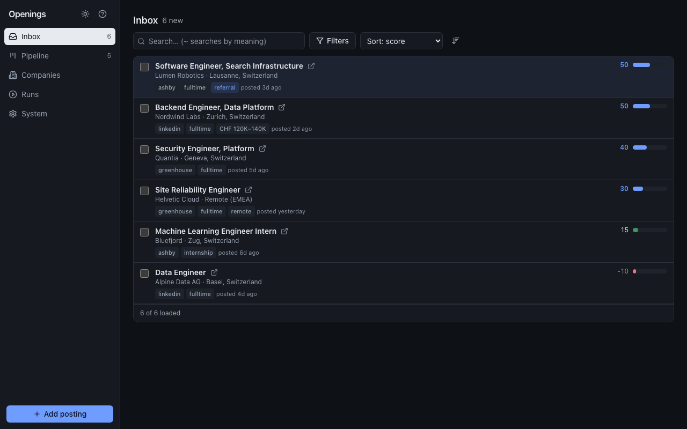
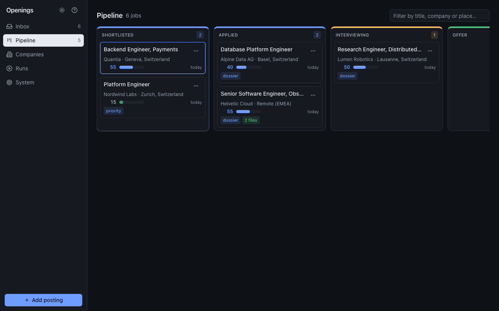
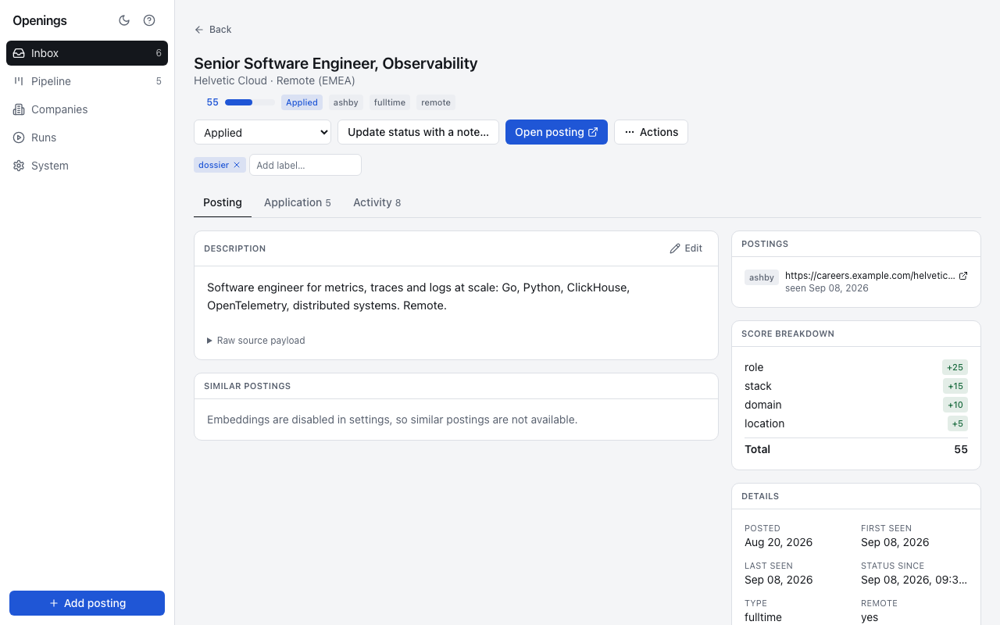
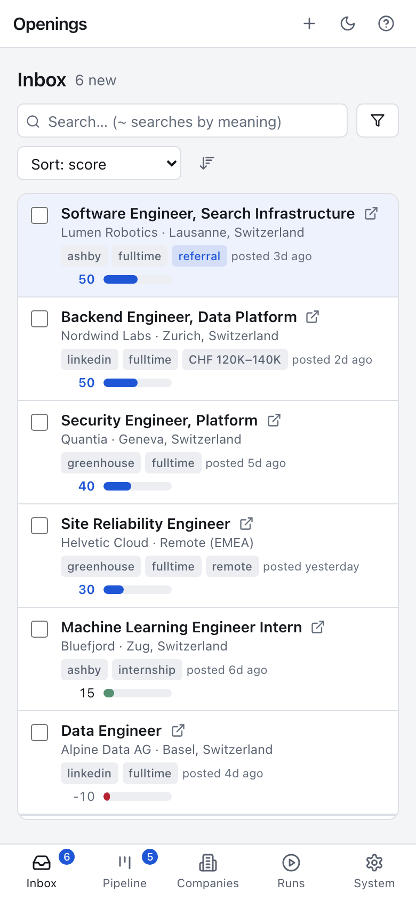
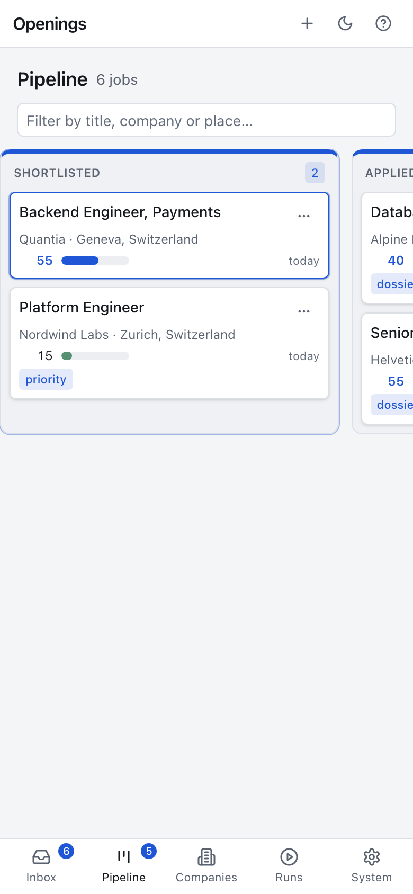
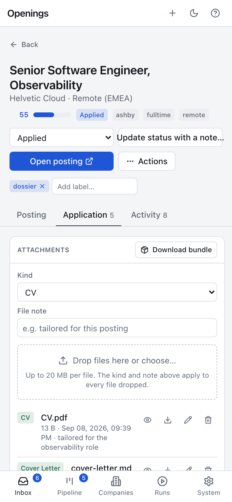

# Dashboard

The dashboard is built for triage: get through new postings fast, keep the
ones you are pursuing in view, and keep the application material with the
job. It works on a phone, a tablet and a desktop, in light and dark (System
follows the operating system; change it in System › Appearance or with the
button in the header). Press `?` anywhere for the shortcut list, which is
generated from the shortcuts that are actually active.

## Views

| Key | View | What it shows |
|-----|------|---------------|
| `1` | Inbox | jobs in status `new`; a dot marks postings that arrived after your previous visit |
| `2` | Pipeline | one column per status from `shortlisted` to `withdrawn`, side by side and scrolling horizontally, each column scrolling on its own; move cards with the keyboard, by dragging, or from the card menu |
| `3` | Companies | configured sources with the health of their last run, and every employer with a stored posting and its status counts |
| `4` | Runs | every collection run: duration, totals, per-source counts, errors grouped by source; "Run now" asks the scheduler to collect |
| `5` | System | appearance, statistics, score distribution, retention with dry-run counts, export, the blacklist with Restore, the settings summary and reference, the API token |

Inbox filters (sources, labels, company, location, job types, remote, score
range, first-seen range, material) live in the URL, so a filtered Inbox is a
link you can keep; the active ones show as removable chips under the toolbar.
One control sorts, one button flips the direction. Scores are drawn relative
to the highest score in the list and take the accent colour at or above the
notify threshold. Search covers title, company, location, description and
notes; a query that starts with `~` runs the semantic search instead. Lists
load a page at a time as you scroll.

## Bulk actions

Tick the checkboxes (or press `Space`, `Shift+J`/`Shift+K`, `*`) and a bar
appears with Shortlist, Applied, Status with a note, Labels, Blacklist and
Delete for the whole selection.

## Job page

Open a job with `Enter`, a double click, or its title. Three tabs, kept in
the URL:

- **Posting**: the description as markdown, every posting of the opening
  (the same job seen on two boards), similar postings, the score breakdown
  (each matched category and its weight), source, dates, salary, links, the
  raw source payload. Edit any posting field from the dialog (`e`).
- **Application**: attachments (drop files, pick the kind: CV, cover letter,
  form answers, other; preview PDFs, images, markdown and text inline;
  download one file or the whole bundle as a zip), form questions with your
  answers, free notes; notes and answers are editable in place.
- **Activity**: the timeline: ingestion, further postings, status changes
  with their notes, labels, notes, attachments, edits, merges.

The header holds the status selector, "Update status with a note", the link
to the posting, labels, and an Actions menu with edit, copy link, download
everything, merge duplicates, blacklist and delete. A blacklisted job shows a banner with Restore. When a
job was opened from a list, `[` and `]` step through that list.

## Keyboard

| Key | Action |
|-----|--------|
| `j` / `k` | next / previous job |
| `Shift+J` / `Shift+K` | extend the selection |
| `Space`, `*` | select the job, select every loaded job |
| `Enter` | open the job page |
| `o` | open the posting in a new tab |
| `s` | shortlist |
| `a` | mark applied |
| `Shift+S` | change status with a note |
| `x` | blacklist (asks first) |
| `d` | delete (asks first) |
| `l` | edit labels |
| `/` | search (`~` prefix for semantic search) |
| `f` | filters |
| `e` | download the current list as CSV (Inbox), edit the posting (job page) |
| `b` | download the application bundle (job page) |
| `n` | add a posting by hand |
| `←` / `→` | previous / next Pipeline column |
| `[` / `]` | move the card one status back / forward (Pipeline); previous / next job (job page) |
| `Esc` | close a dialog, clear the selection, leave the job page |
| `?` | shortcut help |

Every shortcut is listed under `?`; the interface itself carries no key hints.

## Access token

When the server sets `OPENINGS_API_TOKEN`, the dashboard asks for it once and
keeps it in the browser's local storage. Change or clear it in System.
